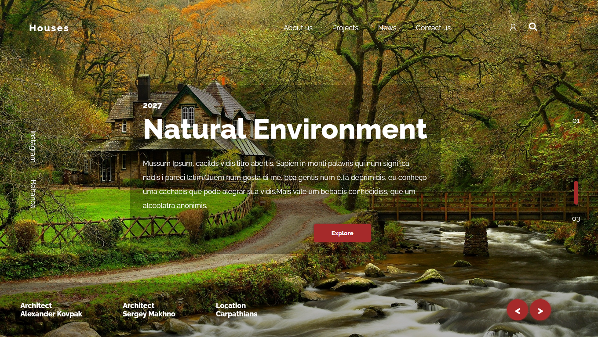

## Intro
This repository is to save small projects then I made to pratice my knowledges.

This branch I made a site using a design templete created by [Vladimir Biondic](https://dribbble.com/Biondic).

The templete:

I'm not thinking of following exactly the template. I want to make layout improvements.
That was the results:

Slider controller working:

---

Feel free to comment and give me feedback.

To look the web site working, [click here on the link!](#)  (LINK IS NOT WORKING YET!)

---

This project was made using the best of:
-  HTML 5
-  CSS 3
-  Javascript

## NOTE

- For each project it has a separate branch.
- The branch name needs to be named with the programming language as suffix