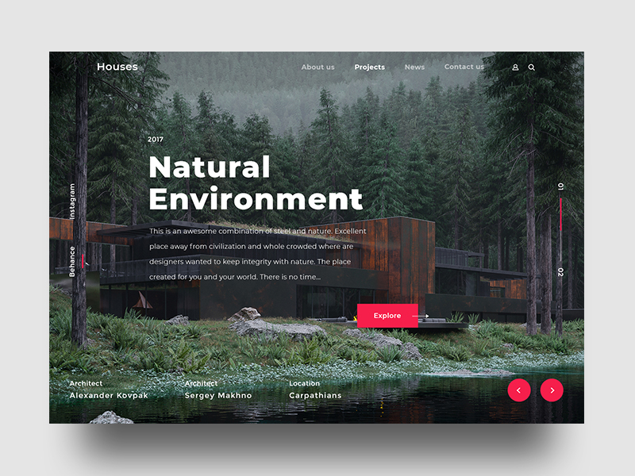

## Intro
This repository is to save small projects then I made to pratice my knowledges.

This branch I made a site using a design templete created by [Vladimir Biondic](https://dribbble.com/Biondic).

The templete:

## NOTE

- For each project it has a separate branch.
- The branch name needs to be named with the programming language as suffix